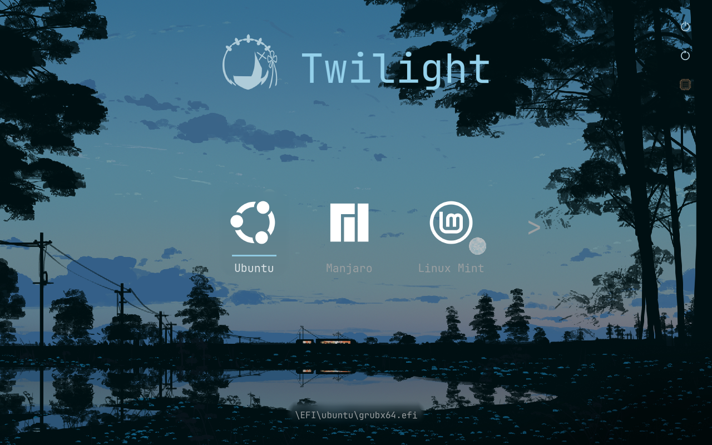

<p align="center">
  
</p>

<p align="center">
A minimal, fast, graphical UEFI boot manager that actually looks of this decade.
</p>

<p align="center">
  
  
</p>

Visor draws an icon-based boot menu that combines the speed and efficiency of
GRUB with the looks of rEFInd. It boots **Linux** (EFI-stub kernels / Unified
Kernel Images) and chainloads any other EFI executable, including Windows.

It is intentionally small: a single ~340 KB `.efi`, no external dependencies,
no scripting language — just a config file and your imagination. Drop the
config entirely and it auto-detects Windows, UKIs, kernels, and BLS/OSTree
deployments on its own, deriving a correct `root=` cmdline by itself.

Beyond the menu it does the modern things too: btrfs/snapper snapshot booting,
OSTree deployment browsing with automatic rollback, live USB hotplug, themes,
mouse and touch, encrypted boot artifacts with a single-password LUKS handoff,
and Secure Boot verification through shim. Two architectures — x86_64 and
AArch64 — build from one tree.

## Install

### Requirements

- An **x86_64** or **AArch64** UEFI system
- **gnu-efi** development files
- **GCC** and **binutils** (`objcopy`)
- **make**, **git**

### Steps

Run this. It installs the build tools for your distro, downloads Visor, builds
it, and installs it to your ESP:

```sh
sh -c "$(curl -fsSL https://raw.githubusercontent.com/IO-ZetZor/Visor-BootManager/main/get.sh)"
```

With `wget` instead:

```sh
sh -c "$(wget -qO- https://raw.githubusercontent.com/IO-ZetZor/Visor-BootManager/main/get.sh)"
```

It builds as your normal user and only asks for `sudo` when it's time to
install. Prefer to read the script first? Download `get.sh`, look it over, then
run it.

Afterwards, edit `<ESP>/EFI/visor/boot.conf` to point at your real kernels — or
delete it and let auto-detection do the work. `visor update` pulls and
reinstalls the latest version at any time.

### Arch Linux (AUR)

Visor is available on the AUR. Install it with your favourite AUR helper:

```sh
yay -S visor
```

Or with any other AUR helper, for example `paru`:

```sh
paru -S visor
```

The AUR package builds Visor from source, installs the EFI binary to
`/usr/lib/visor/` and the `visor` CLI to `/usr/bin/visor`. After installing,
run `visor install` to deploy to your ESP.

Full install guide, installer flags, and the configuration reference: **[here](https://visor-bootmanager.vercel.app/install)**

## How it compares

|                        | Visor | GRUB 2 | systemd-boot | rEFInd | Limine |
|------------------------|-------|--------|--------------|--------|--------|
| Footprint on ESP       | ~340 KB, single binary | Several MB + modules + config machinery | ~100 KB + BLS entries | ~500 KB + icons/themes | ~1 MB + deploy tool |
| Configuration          | One plain-text file — or zero config | Generated `grub.cfg`; hand-editing discouraged | Simple, one file per entry (BLS) | One file, many options; auto-detects too | One `limine.conf`, entries declared by hand |
| Menu                   | Graphical: animations, blur, wallpaper accent colors, mouse/touch, themes | Text menu (themable with effort) | Text only, deliberately | Graphical icons; static, no animation | Text menu with optional wallpaper |
| Boot methods           | EFI-stub/UKI, raw kernels (handover), any EFI chainload | Everything, incl. legacy BIOS and multiboot | EFI binaries only | EFI binaries + legacy kernels via drivers | Limine protocol, Linux, Multiboot 1/2, chainload |
| Auto cmdline for detected kernels | Yes — UKI section / fstab / GPT partition type | n/a (scripted at install time) | No | Partial | No |
| Live USB hotplug in the menu | Yes, animated add/remove | No | No | No | No |
| Btrfs snapshot boot    | Built in (snapper / Timeshift / plain) | Via grub-btrfs add-on | No | No | No |
| Encrypted boot files on the ESP | Built in (VISORENC + one-password LUKS handoff) | Can read LUKS-encrypted `/boot` | No | No | No |
| Secure Boot            | shim/`SHIM_LOCK` aware; sbctl signing in installer | Mature shim integration | Mature | Works with shim/MOK | Sign it yourself; no shim integration |
| Legacy BIOS            | No — UEFI only | Yes | No | No | Yes |
| Scripting              | None, on purpose | Full shell-like language | None | None | None |
| Maturity               | Young (2026), one maintainer | 25+ years | Systemd project, widely deployed | 15+ years | Since 2019, hobby-OS focused |

Honest summary: if you want a bulletproof do-everything loader, use GRUB. If
you want the absolute minimum, systemd-boot. If you're booting your own OS or
still need BIOS, Limine. Visor is for people who want a fast, small,
modern-looking menu with the conveniences built in — and who run UEFI hardware
from this decade. The
[full pros-and-cons page](https://visor-bootmanager.vercel.app/why) doesn't
hide the weak spots.

## Documentation

Everything else — configuration reference, themes, encryption and LUKS, Secure
Boot, snapshots and OSTree, filesystem drivers, the `visor` CLI, architecture
notes, and troubleshooting — is in the **[Wiki](https://visor-bootmanager.vercel.app)**.

A fully commented config reference also ships in
[`boot.conf.example`](boot.conf.example).

## Credits

- **[rEFInd](https://www.rodsbooks.com/refind/)** — the massive inspiration for
  what a boot menu should feel like.
- **[gnu-efi](https://sourceforge.net/projects/gnu-efi/)** — the freestanding
  UEFI toolchain Visor builds on.
- **[EfiFs](https://efi.akeo.ie/)** (Pete Batard) — the filesystem drivers
  Visor can install for non-FAT volumes.
- **[materialyoucolor](https://github.com/T-Dynamos/materialyoucolor-python)** —
  the reference Material You color implementation behind the wallpaper accent
  pipeline.
- Everyone who ran early builds on real hardware and sent in `boot.log` files
  and firmware quirk reports — most of the hardening in every release came
  straight from those.

Written and maintained by [IO-ZetZor](https://github.com/IO-ZetZor).
BSD 2-Clause licensed — see [LICENSE](LICENSE).
